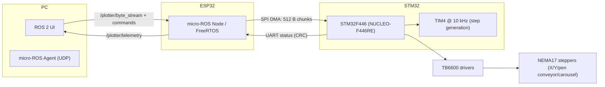
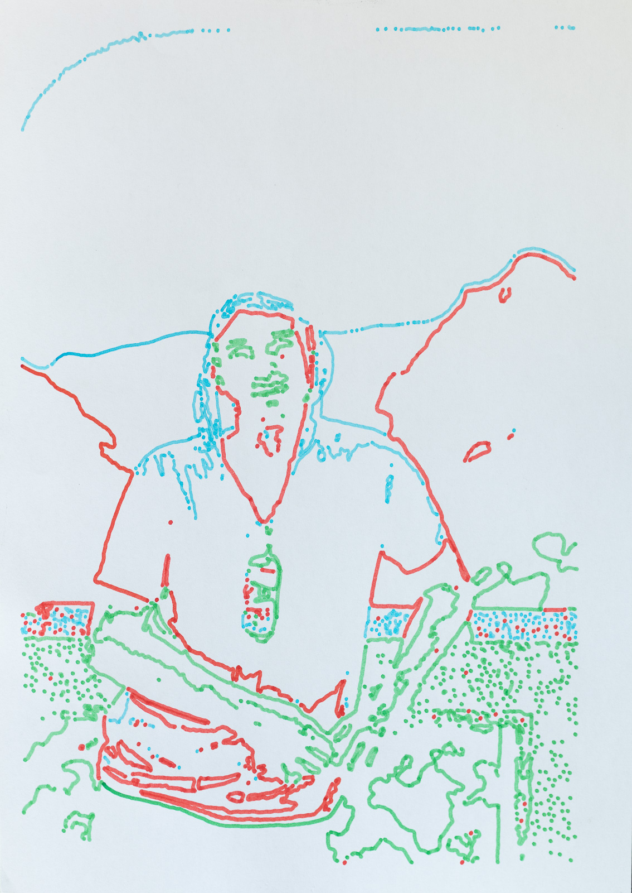

# OmniRevolve Plotter

**XY plotter with 4‑color carousel (mechanically scalable to ~15 colors)** · **STM32F446 (TIM4 @ 10 kHz)** · **ESP32 (FreeRTOS + micro‑ROS over Wi‑Fi)** · **ROS 2 UI** · **SPI DMA 512 B streaming** · **CRC‑based control protocol**

This repository is the **umbrella/portal** for recruiters and technical reviewers: architecture, public mirrors, dev container, and a minimal quick start.

---

## Public repositories

- [omnirevolve-image-processor](https://github.com/omnirevolve/omnirevolve-image-processor) — image → contours → plotter byte stream.
- [omnirevolve-stm32-firmware](https://github.com/omnirevolve/omnirevolve-stm32-firmware) — STM32F446 firmware (TIM4@10kHz, SPI DMA RX, UART CRC, SSD1309).
- [omnirevolve-esp32-core](https://github.com/omnirevolve/omnirevolve-esp32-core) — OLED status, keypad, UART (CRC) to STM32; shared components.
- [omnirevolve-esp32-microros](https://github.com/omnirevolve/omnirevolve-esp32-microros) — ESP32 micro‑ROS bridge: ROS 2 stream → SPI DMA → STM32; telemetry.
- [omnirevolve-ros2-ui](https://github.com/omnirevolve/omnirevolve-ros2-ui) — PC UI (Tkinter): send stream, control, live preview, progress.
- [omnirevolve-ros2-messages](https://github.com/omnirevolve/omnirevolve-ros2-messages) — shared ROS 2 messages (e.g., `PlotterTelemetry`).
- [omnirevolve-protocol](https://github.com/omnirevolve/omnirevolve-protocol) — binary protocol & defines (service/step bytes, EOF = 0x3F).

---

## System architecture



---

## Quick start (PC side)

```bash
# micro-ROS Agent (UDP)
ros2 run micro_ros_agent micro_ros_agent udp4 --port 8888

# UI (from omnirevolve-ros2-ui)
python3 ui.py
# or: ros2 run omnirevolve_ros2_ui ui
```

---

## Container image (GHCR)

Pull the prebuilt development image and run it (no GUI dependencies):

```bash
docker pull ghcr.io/omnirevolve/omnirevolve-dev:humble
docker run -it --name omni_dev --network host   --device /dev/ttyUSB0 --device /dev/ttyACM0   -v $HOME/omnirevolve_ws:/work   ghcr.io/omnirevolve/omnirevolve-dev:humble
```

Prefer **Compose** and see detailed instructions in **[docs/CONTAINERS.md](docs/CONTAINERS.md)**.

---

## Firmware usage (ESP32 micro‑ROS)

A condensed view; the **full workflow with commands** lives in **docs/CONTAINERS.md**.

1. Start the container and open a shell: `docker compose up -d && docker exec -it omni_dev bash`  
2. Configure Agent IP/port:  
   ```bash
   cd ~/ros2_ws/firmware/freertos_apps/apps/omnirevolve_esp32_microros
   ./firmware.sh --agent-ip <HOST_IP> --agent-port 8888 configure
   ```
3. First‑time Wi‑Fi setup via `menuconfig`.  
4. Build / Flash / Monitor:  
   ```bash
   ./firmware.sh build
   ./firmware.sh flash
   ./firmware.sh monitor
   ```

> The image ships with ROS 2 Humble, micro‑ROS Agent, helpers (`rosenv`, `idfenv`), and cloned sources to speed up onboarding. See **docs/CONTAINERS.md** for all details.

---

## Media

Photos and YouTube previews (clickable thumbnails). Replace `VIDEO_ID_X` with your IDs.

### Photos
<p align="center">
  
</p>
<p align="center">
  
  
</p>

### Videos
<p align="center">
  <a href="https://www.youtube.com/watch?v=epHM4n3US48">
    
  </a>
  <a href="https://www.youtube.com/watch?v=NMgnAYHxDm4">
    
  </a>
  <a href="https://www.youtube.com/watch?v=BMJWWeqkJn0">
    
  </a>
</p>

---

## Models (CAD) — *Coming soon*
A short bill of parts and printable STL files for the carousel, head, and axes will be published here together with assembly notes.

## BOM — *Coming soon*
A minimal BOM (motors, drivers, sensors, belts, pulleys, bearings, PSU) with links and quantities will be published soon.

---

## License

MIT — see [LICENSE](LICENSE).
