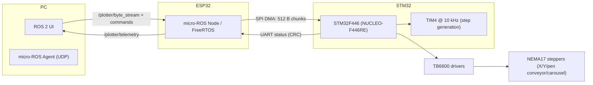
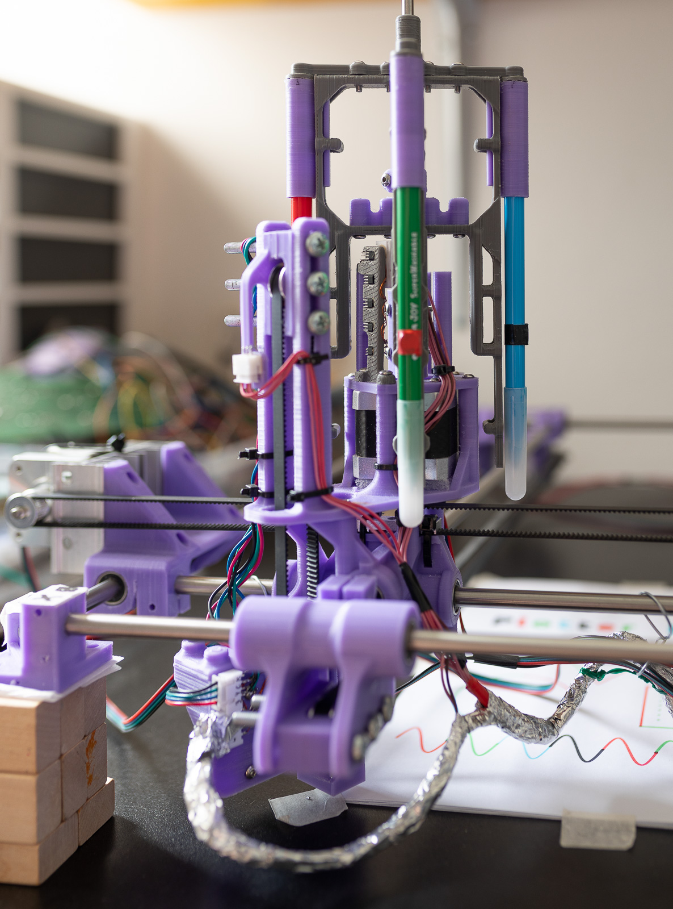
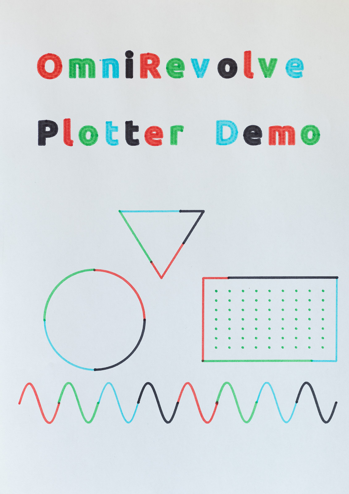

# OmniRevolve Plotter

**XY plotter with 4-color carousel** · **STM32F446 (TIM4 @ 10 kHz)** · **ESP32 (FreeRTOS + micro-ROS over Wi‑Fi)** · **ROS 2 UI** · **SPI DMA 512 B streaming** · **CRC-based control protocol**

This repository is the **umbrella/portal** for recruiters and technical reviewers: architecture, links to public mirrors, and a minimal quick start.

---

## Public repositories

- [omnirevolve-image-processor](https://github.com/omnirevolve/omnirevolve-image-processor) — image → contours → plotter byte stream.
- [omnirevolve-stm32-firmware](https://github.com/omnirevolve/omnirevolve-stm32-firmware) — STM32F446 firmware (TIM4@10kHz, SPI DMA RX, UART CRC, SSD1309).
- [omnirevolve-esp32-core](https://github.com/omnirevolve/omnirevolve-esp32-core) — OLED status, keypad, UART (CRC) to STM32; shared components.
- [omnirevolve-esp32-microros](https://github.com/omnirevolve/omnirevolve-esp32-microros) — ESP32 micro‑ROS bridge: ROS 2 stream → SPI DMA → STM32; telemetry.
- [omnirevolve-ros2-ui](https://github.com/omnirevolve/omnirevolve-ros2-ui) — PC UI (Tkinter): send stream, control, live preview, progress.
- [omnirevolve-ros2-messages](https://github.com/omnirevolve/omnirevolve-ros2-messages) — shared ROS 2 messages (e.g., `PlotterTelemetry`).
- [omnirevolve-protocol](https://github.com/omnirevolve/omnirevolve-protocol) — binary protocol & defines (service/step bytes, EOF = 0x3F).

---

## System architecture



---

## Quick start (PC side)

```bash
# Start micro-ROS Agent (UDP)
ros2 run micro_ros_agent micro_ros_agent udp4 --port 8888

# Launch UI (from omnirevolve-ros2-ui)
python3 ui.py
# or: ros2 run omnirevolve_ros2_ui ui
```

---

## Container image (GHCR)

Pull the prebuilt development image and run it (no GUI dependencies):

```bash
docker pull ghcr.io/omnirevolve/omnirevolve-dev:humble
docker run -it --name omni_dev --network host   --device /dev/ttyUSB0 --device /dev/ttyACM0   -v $HOME/omnirevolve_ws:/work   ghcr.io/omnirevolve/omnirevolve-dev:humble
```

Or use Compose (recommended). See **[docs/CONTAINERS.md](docs/CONTAINERS.md)**.

---

## Media

Place the following (optional) files and they will be shown in this README:

- `docs/media/main-demo.gif` (main demo)
- `docs/media/plotter.jpg` (hardware photo)
- `docs/media/result.jpg` (sample output)

```md


<p align="center">
  
  
</p>
```

---

## License

MIT — see [LICENSE](LICENSE).
